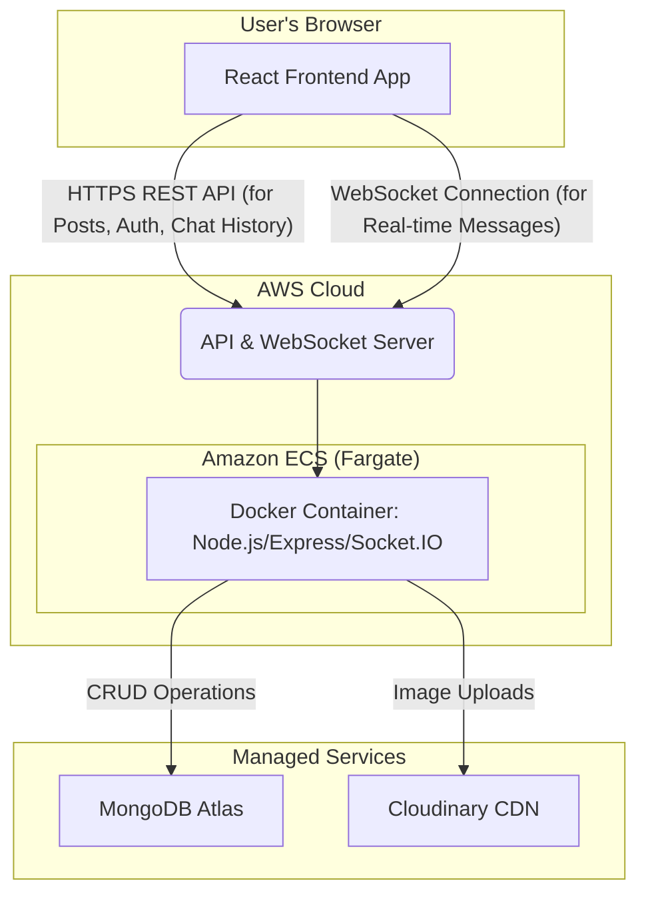

#  Echo: Full-Stack Social Media Platform with Real-Time Chat

[](https://react.dev/) [](https://expressjs.com/) [](https://socket.io/) [](https://www.docker.com/) [](https://aws.amazon.com/ecs/)

Echo is a **full-stack, production-grade social media platform** built for scale. It features a robust, containerized backend powering a REST API for posts and profiles, and a real-time WebSocket API for its integrated chat application. The frontend is a modern, responsive React application.

---

## 📸 Showcase

<p align="center">
  
  
</p>

---

## ✨ Core Features

* **Full-Stack Application:** Includes both the backend server and a feature-rich React frontend.
* **Real-Time Chat:** A complete one-on-one messaging system built with **Socket.IO**, featuring:
    * Live message delivery.
    * A smart sidebar showing recent chats and friends available to chat.
    * Persistent message history.
* **Rich Content Posts:** Users can create posts with an ordered sequence of text and image blocks.
* **Stateless JWT Authentication:** Secure, scalable user authentication for both the REST API and WebSocket connections.
* **Cloud-Native & Containerized:** The backend is fully Dockerized and designed for deployment on cloud services like AWS ECS.
* **Performance Validated:** Includes an advanced K6 testing suite to stress test the backend and identify performance limits.

---

## ⚙️ System Architecture

The application uses a decoupled frontend/backend architecture, communicating via both HTTPS for standard API requests and WebSockets for real-time events.



---

## 🛠️ Tech Stack

| Category         | Technology                                                                                                  |
| ---------------- | ----------------------------------------------------------------------------------------------------------- |
| **Frontend** | **React**, **TypeScript**, **Tailwind CSS**, **ShadCN UI**, **Axios**, **Socket.IO Client** |
| **Backend** | **Node.js**, **Express.js**, **Socket.IO Server** |
| **Database** | **MongoDB Atlas** with **Mongoose** ODM                                                                     |
| **Authentication** | **JSON Web Tokens (JWT)** |
| **Media Storage** | **Cloudinary** for image uploads and CDN delivery                                                           |
| **DevOps & Cloud** | **Docker** (Multi-stage builds), **Amazon ECS (Fargate)** |
| **Testing** | **K6** for backend stress and spike testing                                                                 |

---

## 🚀 Getting Started

### Prerequisites

-   Node.js (v18 or later)
-   npm or yarn
-   Git
-   Docker (for running the backend)

### 🧪 Run Locally

You'll need to run both the backend and frontend servers in separate terminal windows.

#### 1. Backend Setup

```bash
# Clone the backend repository
git clone [https://github.com/yourusername/echo-backend.git](https://github.com/yourusername/echo-backend.git)
cd echo-backend

# Install dependencies
npm install

# Create a .env file and add your secrets (see below)
# ...

# Run the backend dev server
npm run dev
```

#### 2. Frontend Setup

```bash
# Clone the frontend repository
git clone [https://github.com/yourusername/echo-frontend.git](https://github.com/yourusername/echo-frontend.git)
cd echo-frontend

# Install dependencies
npm install

# Run the frontend dev server
npm run dev
```
The React app will typically start on `http://localhost:5173`.

---
## 🐳 Running Backend with Docker

The backend is fully containerized for easy deployment.

```bash
# From the backend directory
docker build -t your-dockerhub-username/echo-backend .
docker run -p 8000:8000 --env-file .env your-dockerhub-username/echo-backend
```

---

## 🧪 Advanced Performance Testing (K6)

To validate production-readiness, the backend was subjected to multiple advanced load testing scenarios using K6. This includes both **stress tests** to find the system's limits and **spike tests** to ensure resilience against sudden traffic surges.

### Stress Test: Finding the Breaking Point

A ramping-vus (virtual users) test was conducted to determine the upper limits of the current single-container architecture. The load was gradually increased from 25 to 250 concurrent users.

-   **Result:** The system remained **100% stable up to 150 VUs**.
-   **Breaking Point:** Around **250 VUs**, the server became saturated, leading to a ~1.2% error rate (`connection reset by peer`), which successfully identified the scaling bottleneck.


### Spike Test: Handling Sudden Surges

A spike test was conducted to ensure the system could handle a sudden, massive increase in traffic.

-   **Result:** The backend successfully handled a spike of **500 concurrent users** for 3 minutes with a **100% success rate**.


| Metric          | Result                            |
| --------------- | --------------------------------- |
| **Virtual Users** | **500 (Spike)** |
| **Success Rate** | **100%** |
| **Avg. RPS** | **~61 requests/s** |
| **p(95) Latency** | **~7.3s** (including image uploads) |

---

## 📌 Project Roadmap

-   [x] Rich content post support
-   [x] Full real-time chat feature
-   [x] Dockerize the backend
-   [x] Deploy to AWS ECS
-   [x] Implement K6 stress & spike testing
-   [ ] Refactor backend to a microservices architecture
-   [ ] Add Redis for caching
-   [ ] Implement real-time notifications (likes, comments)
-   [ ] Set up a CI/CD pipeline with GitHub Actions

---

## 🧑‍💻 Author

**Chandan R**

B.Tech CSE graduate passionate about building scalable full-stack applications, cloud infrastructure, and DevOps practices.

> Let's connect on [LinkedIn](https://linkedin.com/in/chandan--r)!